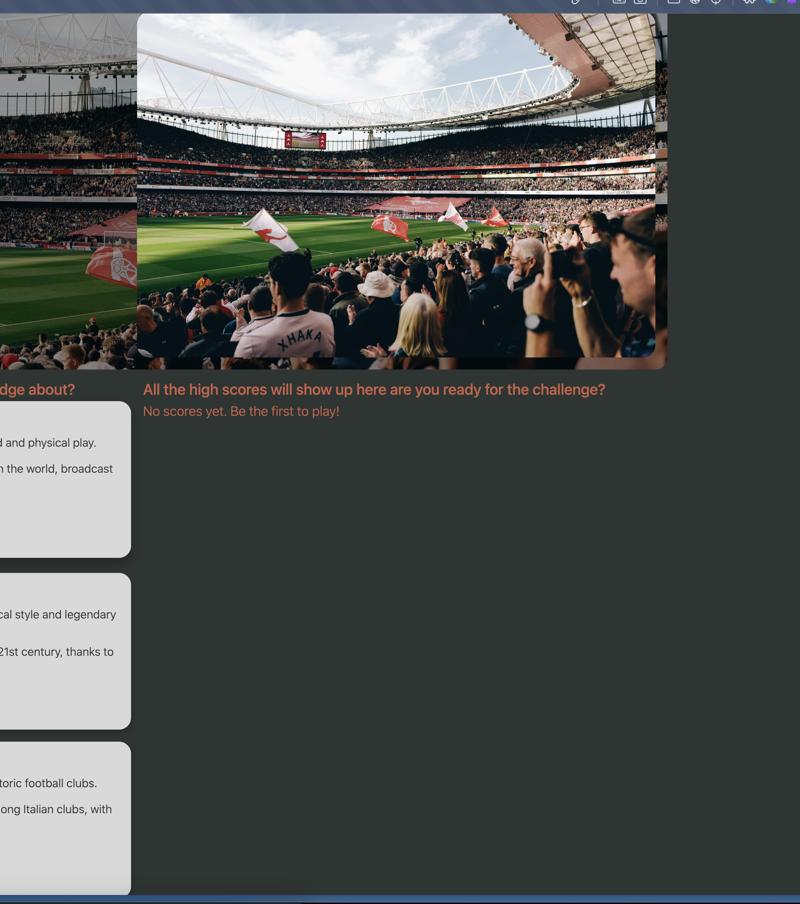
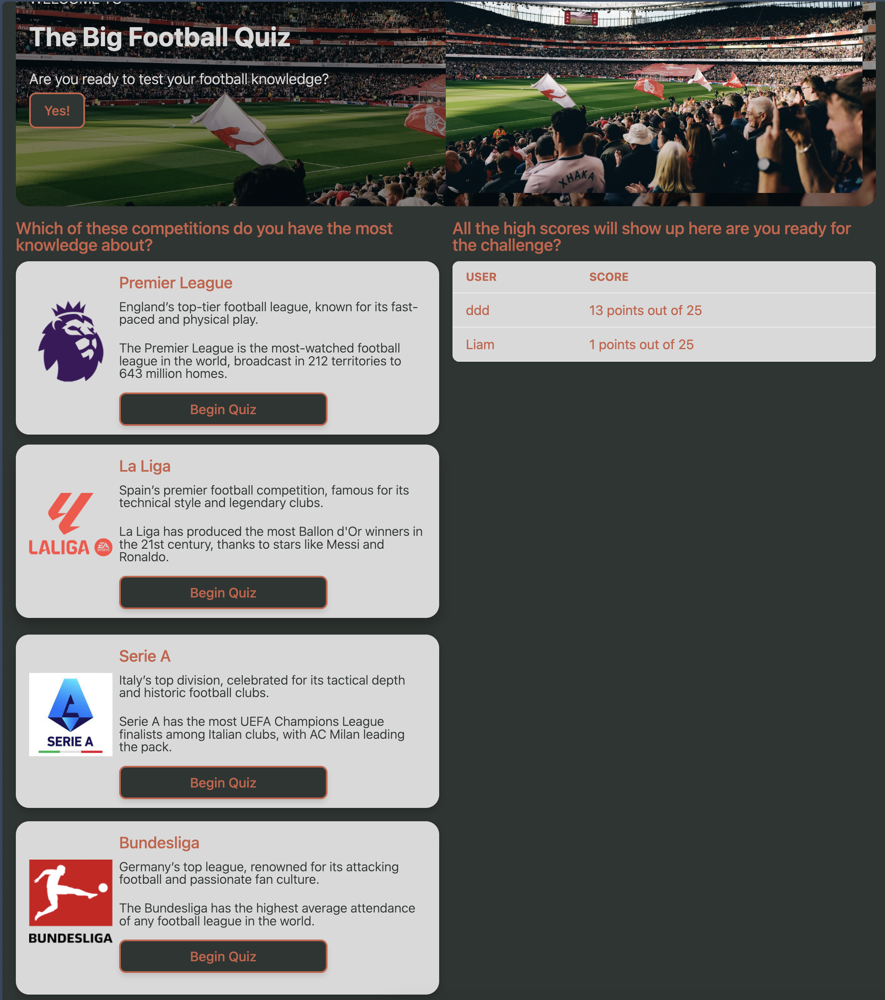
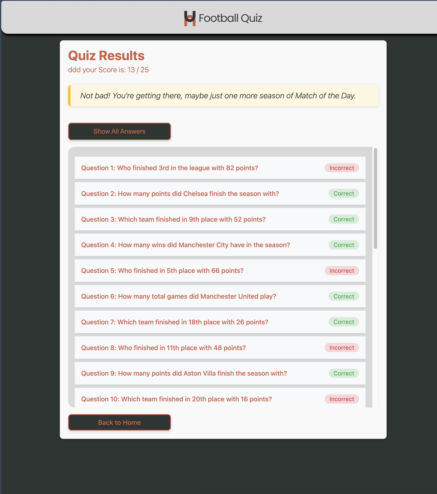
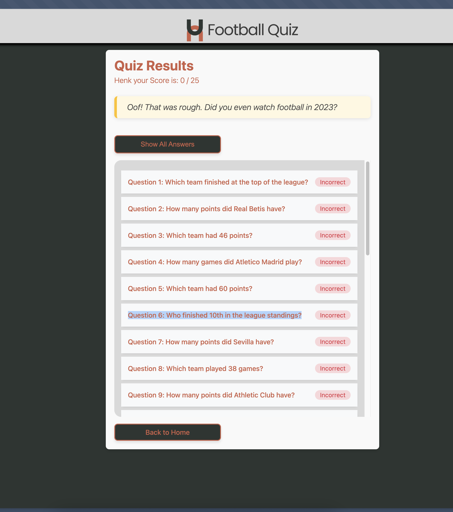

## Week 1

In deze week heb ik het idee bedacht. Mijn eerste idee was om een flascore clone te maken. Bij flascore kan je live uitslagen van voetbal bekijken en ook details van spelers/clubs. Bij dit idee ben ik opzoek gegaan naar een Api waar ik live voetbal data uit kon krijgen. Deze had ik gevonden namelijk de [Football API](https://www.api-football.com/documentation-v3#tag/Countries/operation/get-countries). Ik wilde eigenlijk een clone maken van de app dus met een aantal competities en detailpagina's voor spelers.

## Week 2

Ik heb na een feedback gesprek met Declan mijn idee aangepast. Namelijk: een voetbal quizz. Dit maakt het idee wat leuker en niet zo simpel. Daarom heb ik bedacht om ook de API van chatgpt te gebruiken om de vragen te genereren hiervoor heb ik een abbonement genomen op chatgpt en nu kan ik de api gebruiken. Ik maak verbinding met de voetbal API en hier haal ik van de top 5 competities de data op die geef ik vervolgens weer aan chatgpt die dan op basis hiervan 5 vragen terug geeft. Deze 5 vragen geeft hij terug in JSON en die lees ik op de pagina. Elke vraag heeft 3 antwoorden en een boolean per antwoord welk antwoord correct is. Hiermee kan ik later de score bijhouden.

## Week 3

Deze week heb ik gewerkt aan het koppelen van alles. De frontend laat de vragen zien die gegenereerd worden door ChatGPT, en ik heb een systeem gebouwd waarmee de gebruiker antwoordopties kan kiezen. Na het invullen worden de antwoorden vergeleken met het juiste antwoord en wordt de score berekend.

Ik heb ook een results-pagina toegevoegd waar je na het invullen van de quiz je score en feedback per vraag kunt zien.

Daarnaast ben ik bezig geweest met de layout, het stylen van de quizpagina's en het dynamisch laden van competities.

## Week 4

Alles is af. De quiz werkt van begin tot eind: van het ophalen van live data, tot het genereren van vragen met ChatGPT, tot het tonen van resultaten na het invullen.  
De gebruiker kiest een competitie, krijgt vragen op basis van echte data, en ziet aan het einde direct de score en of zijn antwoorden juist waren.

### Wat is er af:

- ✅ Live voetbaldata ophalen via de Football API
- ✅ Automatisch quizvragen genereren via de ChatGPT API
- ✅ Dynamische quizpagina met antwoordkeuzes
- ✅ Resultatenpagina met correcte antwoorden en score

## Week 5 herkansing

Voor de herkansing heb ik, zoals gevraagd, de styling van de pagina waarop de vragen worden weergegeven verbeterd, evenals de resultatenpagina.

Ik heb twee Web API's gebruikt, namelijk de [View Transition API](https://developer.mozilla.org/en-US/docs/Web/API/View_Transition_API) en de [Web Audio API](https://developer.mozilla.org/en-US/docs/Web/API/Web_Audio_API).

De View Transition API heb ik toegevoegd om de overgangen tussen pagina’s te verbeteren. Deze heb ik ook toegepast op de afbeeldingen van de competities.

Daarnaast heb ik audio toegevoegd om de quiz leuker te maken: een tikkend geluid tijdens de quiz en een buzzer-geluid wanneer de tijd is verstreken. Als de tijd afloopt, verschijnt er een melding (alert) en wordt de quiz automatisch ingediend.

In Liquid heb ik een `if`-statement toegevoegd die "No scores yet. Be the first to play!" weergeeft als er nog geen scores zijn. Als er wél scores zijn, worden deze weergegeven in een tabel.
Ook laat ik, op basis van het resultaat, met een `if`-statement een bericht zien dat past bij je score. 
 
 
 

 
 
